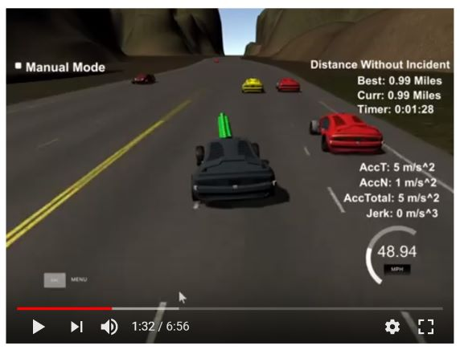

# Path Planning
Project 1 of term 3 of Udacity self-driving car nanodegree

  

Description of our implementation is available [here](writeup.md).

## Setup

This project involves the Term 3 Simulator which can be downloaded [here](https://github.com/udacity/self-driving-car-sim/releases/tag/T3_v1.2).
Follow instructions [here](https://github.com/udacity/CarND-Path-Planning-Project) to set up Ubuntu and Mac environments.

## Usage

1. Set up project environemnt as specified above.
2. Compile the files to create the main executable of the project:
    * Make a build directory: `mkdir build && cd build`
    * Compile: `cmake .. && make`
3. Run Term 3 Simulator, select resolution and graphics quality, press "Play!".
4. Run the main executable ( build/path_planner ) of the project.
5. Press "Select" button in the simulator window.

## Files

* src - folder of the source files
* writeup.md - description of implementation of path planning
* images - folder of images used in writeup.md
